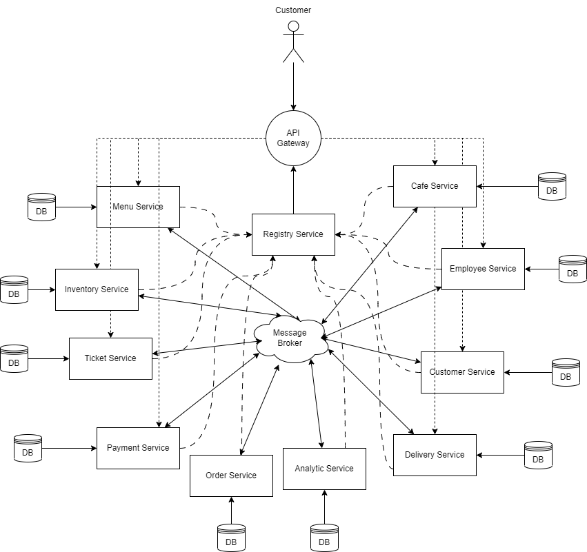

# ETS PPLBO 2023

| NAMA  | LUTHFI MAAJID |
|-------|---------------|
| NIM   | 201524050     |
| KELAS | 3B            |

## Diagram Arsitektur

## Services Definition
### 1. Analytic Service
    Storing analytic data such as cooking time and delivering for upstream use.
### 2. Api Gateway
    Proxy server
### 3. Cafe Service
    Handling data for cafe itself such as name and location.
### 4. Customer Service
    Handling data for customer, such as customer personal information.
### 5. Delivery service
    Handling delivery process.
### 6. Discovery Server
    Act as a service registry for storing each sevices address.
### 7. Employee Service
    Handling data for employee, such as name and availablity staus for delivering.
### 8. Inventory Service
    Handling stock for each menu in a cafe.
### 9. Order Service
    Handling customer order and act as a service orchestrator.
### 10. Payment Service
    Handling payment for order.
### 11. Proto-common (Not a Service)
    Shared protobuffer definition for gRPC based communication.
### 12. Ticket Service
    Handling for processing menu in a cafe.

## Tech stack:
1. Spring Boot 3
2. Apache Kafka + Zookeeper
3. gRPC
4. RESTful
5. MongoDB
6. PostgreSQL
7. MySQL
8. Docker

